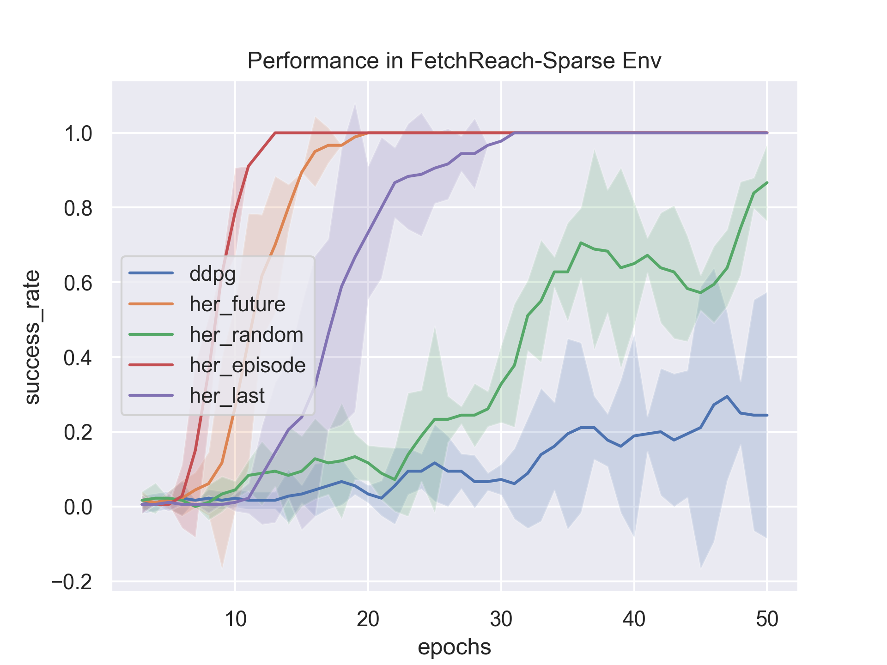
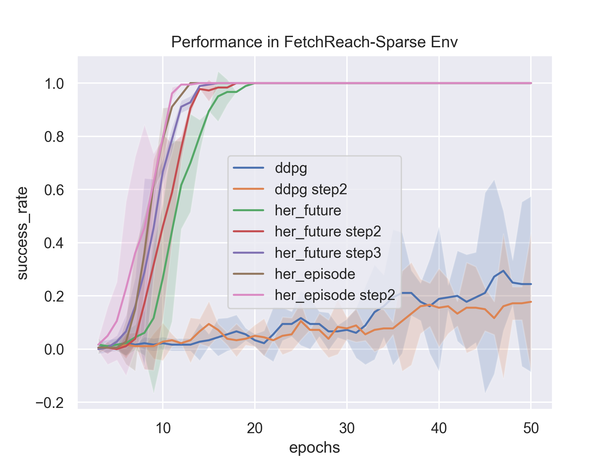
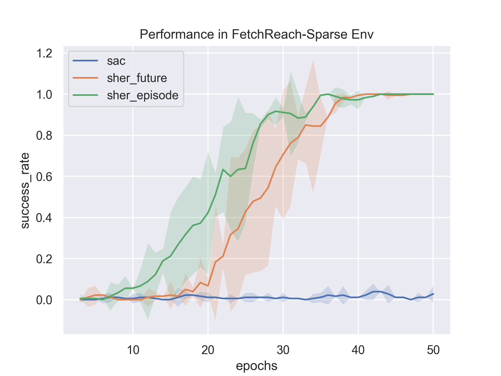

# Modular-HER 
Modular-HER is revised from OpenAI baselines and supports many improvements for Hindsight Experience Replay (HER) as modules. We aim to provide a more **modular**, **readable** and **consice** package for Multi-goal Reinforcement Learning.


## Functions
- [x] DDPG (https://arxiv.org/abs/1509.02971);
- [x] HER (future, episode, final, random) (https://arxiv.org/abs/1707.01495);
- [x] Cut HER (incrementally increase the future sample length);
- [x] SHER (https://arxiv.org/abs/2002.02089);
- [x] Prioritized HER (same as PHER in https://arxiv.org/abs/1905.08786);
- [ ] Energe-based Prioritized HER(https://www.researchgate.net/publication/341776498_Energy-Based_Hindsight_Experience_Prioritization);
- [ ] Curriculum-guided Hindsight Experience Replay (http://papers.nips.cc/paper/9425-curriculum-guided-hindsight-experience-replay);
- [x] nstep DDPG and nstep HER;
- [ ] more to be continued...


## Prerequisites 
Require python3 (>=3.5), tensorflow (>=1.4,<=1.14) and system packages CMake, OpenMPI and zlib. Those can be installed as follows

#### Ubuntu :
```bash
sudo apt-get update && sudo apt-get install cmake libopenmpi-dev python3-dev zlib1g-dev
```

#### Mac OS X  :
With [Homebrew](https://brew.sh) installed, run the following:
```bash
brew install cmake openmpi
```

## Installation
```bash
git clone https://github.com/YangRui2015/Modular_HER.git
cd Modular_HER
pip install -e .
```


## Usage
Training and saving models,saving logs.
```bash
python -m mher.run --env=FetchReach-v1 --num_epoch 30 --num_env 1 --sampler her_future --play_episodes 5 --log_path=~/logs/fetchreach/ --save_path=~/logs/models/fetchreach_herfuture/
```

## Results

We use a group of test parameters in DEFAULT_ENV_PARAMS for performance comparison in FetchReach-v1 environment. 

1. Performance of HER of different goal sample methods (future, random, episode, last).

<div  align="center"> </div>    

2. Performance of Nstep HER and Nstep DDPG.

<div  align="center"></div>

3. Performance of SHER (Not good enough in FetchReach environment, I will test more envs to report). 

<div  align="center"></div>


## Update

* 9.27 V0.0: update readme;
* 10.3 V0.5: revised code framework hugely, supported DDPG and HER(future, last, final, random);
* 10.4 V0.6: update code framework, add rollouts and samplers packages;
* 10.6 add nstep sampler and nstep her sampler;
* 10.7 fix bug of nstep her sampler;
* 10.16 add priority experience replay and cut her;
* 10.31 add SHER support;
